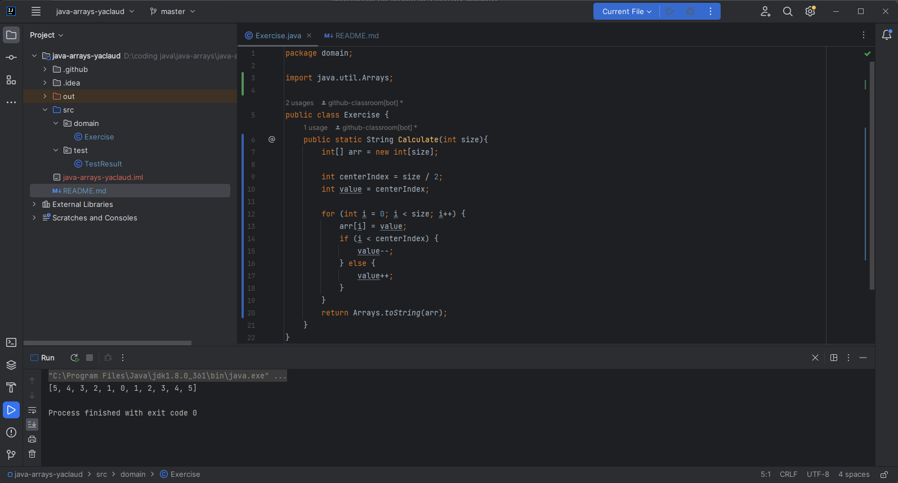

# Завдання:
Заповнити масив довільного розміру числами в порядку зростання, починаючи з центру масиву, наприклад, `[5,4,3,2,1,0,1,2,3,4,5]`
# Код:
```java
package domain;

import java.util.Arrays;

public class Exercise {
    public static String Calculate(int size){
        int[] arr = new int[size];

        int centerIndex = size / 2;
        int value = centerIndex;

        for (int i = 0; i < size; i++) {
            arr[i] = value;
            if (i < centerIndex) {
                value--;
            } else {
                value++;
            }
        }
        return Arrays.toString(arr);
    }
}
```
# Результат роботи з розміром масива 11:
* `[5, 4, 3, 2, 1, 0, 1, 2, 3, 4, 5]`
* Скріншот: 